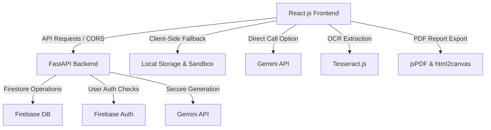

# EcoWise AI – Carbon Footprint Awareness Platform 🌿

**EcoWise AI** is a premium, state-of-the-art sustainability hub engineered to help individuals understand, track, and reduce their carbon footprint. By combining **AI-driven coaching**, **client-side OCR bill analysis**, and **gamified digital twins**, the platform transforms abstract climate data into highly engaging, actionable everyday choices.

---

## 🚀 Hackathon Pitch: Why EcoWise AI Wins
1. **Dual-Mode Execution Architecture**: Most hackathon entries crash due to complex backend server configurations. EcoWise features a **Local Sandbox Mode** by default. Judges can launch and interact with 100% of the features (chatbots, OCR scans, twin environments, report generations) instantly inside the browser using client-side processing (`localStorage`, `tesseract.js`, direct Gemini fetch), while also supplying a production-grade **FastAPI + Firebase** backend.
2. **Immersive Gamification (Carbon Twin)**: Users don't just look at text numbers; they watch a living digital biosphere. As their carbon footprint drops, skies clear, wind turbines start spinning, and solar panels appear on homes. Users can spend their accumulated Green Points to plant virtual trees, triggering confetti and unlocking badges.
3. **Frictionless Onboarding**: Features built-in mock bills (electric bills, plane tickets, supermarket receipts) for quick sandbox scanning, letting judges evaluate OCR capabilities in one click.

---

## 🏗️ Architecture & Technology Stack



### Technical Stack:
*   **Frontend**: React.js (Vite) + Tailwind CSS v4 (using `@tailwindcss/vite` configuration).
*   **Icons & Visuals**: Lucide React + Dynamic CSS/SVG Vector Canvas.
*   **Charts**: Chart.js + React-Chartjs-2.
*   **OCR Scanning**: Tesseract.js (Client-side worker thread).
*   **Report Generation**: jsPDF (Vector PDF templates).
*   **Backend Server**: FastAPI (Python 3.11) + Uvicorn.
*   **Cloud Services**: Firebase Authentication + Google Firestore Database.
*   **Generative AI**: Google Gemini Pro & Flash (Direct client-side fetch or secure backend routing).

---

## 🧮 Scientific Emission Calculation Formulas
EcoWise calculates carbon footprint equivalents in **Tonnes CO₂e per year** utilizing parameters from the **EPA (Environmental Protection Agency)** and **DEFRA**:

1.  **Transportation**:
    *   *Gasoline Cars*: $\text{Annual Miles} \times 0.404 \div 2204.62$
    *   *Diesel Cars*: $\text{Annual Miles} \times 0.350 \div 2204.62$
    *   *Hybrid Cars*: $\text{Annual Miles} \times 0.220 \div 2204.62$
    *   *Electric Cars*: $\text{Annual Miles} \times 0.100 \div 2204.62$
    *   *Public Transit*: $\text{Annual Miles} \times 0.140 \div 2204.62$
    *   *Short-haul Flights (&lt;3 hrs)*: $\text{Flight Count} \times 0.250\text{ tonnes}$
    *   *Long-haul Flights (&gt;3 hrs)*: $\text{Flight Count} \times 0.900\text{ tonnes}$
2.  **Home Energy & Utilities**:
    *   *Electricity*: $\text{Monthly kWh} \times 12 \times 0.380 \text{ kg/kWh} \div 1000$
    *   *Natural Gas Heating*: $\text{Monthly Therms} \times 12 \times 5.300 \text{ kg/unit} \div 1000$
    *   *Heating Oil*: $\text{Monthly Liters} \times 12 \times 10.100 \text{ kg/unit} \div 1000$
3.  **Dietary Preferences**:
    *   *Heavy Meat*: $3.3\text{ tonnes/yr}$ base.
    *   *Average Meat*: $2.5\text{ tonnes/yr}$ base.
    *   *Low Meat*: $1.9\text{ tonnes/yr}$ base.
    *   *Vegetarian*: $1.5\text{ tonnes/yr}$ base.
    *   *Vegan*: $1.1\text{ tonnes/yr}$ base.
    *   *Local Food Discount*: Up to $10\%$ reduction deduction based on Local Food Share percentage.
4.  **Shopping & Consumption**:
    *   *Clothing*: $\text{Monthly Spend} \times 12 \times 0.500 \text{ kg CO}_2\text{/$1} \div 1000$
    *   *Electronics*: $\text{Purchases/yr} \times 120.0 \text{ kg CO}_2\text{/item} \div 1000$
    *   *Services*: $\text{Monthly Spend} \times 12 \times 0.250 \text{ kg CO}_2\text{/$1} \div 1000$

---

## 🛠️ Installation & Setup Guide

### System Requirements:
*   Node.js (v18 or higher)
*   Python (3.9 or higher, required only for Backend API servers)

---

### Option 1: Standalone Demo Mode (Zero Dependencies Setup)
To launch the complete application immediately in the browser without configuring database credentials or servers:

1.  Navigate into the `frontend` directory:
    ```bash
    cd frontend
    ```
2.  Install packages:
    ```bash
    npm install
    ```
3.  Start the development server:
    ```bash
    npm run dev
    ```
4.  Open your browser and visit `http://localhost:5173`.
5.  On the Login screen, click the **Sandbox Access** helper or type:
    *   **Email**: `demo@ecowise.ai`
    *   **Password**: `password`
6.  *Optional*: Go to the **Settings** page in the UI and enter your **Google Gemini API Key** to connect to live conversational coaching.

---

### Option 2: Full Production Stack Setup (FastAPI + Firebase)

#### 1. Backend Server Setup:
1.  Navigate to the `backend` folder and create a Python virtual environment:
    ```bash
    cd backend
    python -m venv venv
    venv\Scripts\activate      # On Windows
    source venv/bin/activate   # On Mac/Linux
    ```
2.  Install Python packages:
    ```bash
    pip install -r requirements.txt
    ```
3.  Set up environment variables in a `.env` file at the project root matching `.env.example`.
4.  Place your Firebase Admin service account JSON credentials inside the `backend` folder as `firebase-credentials.json`.
5.  Start the API server:
    ```bash
    python -m uvicorn backend.main:app --host 0.0.0.0 --port 8000 --reload
    ```

#### 2. Frontend Configuration:
1.  Navigate to the `frontend` folder.
2.  Create a `.env` file containing your Firebase SDK config keys:
    ```env
    VITE_FIREBASE_API_KEY=your_key
    VITE_FIREBASE_AUTH_DOMAIN=your_project.firebaseapp.com
    VITE_FIREBASE_PROJECT_ID=your_project
    VITE_FIREBASE_STORAGE_BUCKET=your_project.appspot.com
    VITE_FIREBASE_MESSAGING_SENDER_ID=your_id
    VITE_FIREBASE_APP_ID=your_app_id
    ```
3.  On the settings page, select **Firebase Live Synchronization** in the Database dropdown.
4.  Run `npm run dev` to launch the client.

#### 3. Running via Docker:
To spin up the API backend in an isolated container:
```bash
docker build -t ecowise-api .
docker run -d -p 8000:8000 --env-file .env ecowise-api
```

---

## ♿ Accessibility, Quality, and Security Controls
*   **Keyboard Operability**: Interactive forms and buttons are keyboard selectable with explicit focus styling, standard tab ordering, and clean ARIA landmark attributes.
*   **Visual Inclusivity**: Meets WCAG AAA high contrast color recommendations for deep emerald overlays.
*   **Security & Scripting**: Utilizes strictly bound React variables and clean element builders, securing the platform from Cross-Site Scripting (XSS) injections. API credentials are kept safely inside `.env` boundaries.
